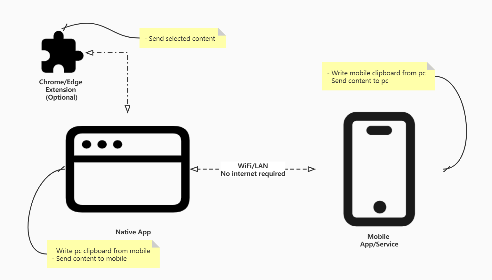

# kingfisher
A clipboard sync toolset between mobile phone and pc, no matter what browser or os you use.

## Diagram

The toolset consists of 3 parts: native app, mobile app and an optional chrome/edge extension. 

It doesn't need internet, so there is no server programs and no worry about data privacy. The disadvantage is that it requires the equipment to be in the same LAN to use.

## Native App

Created by electron, support `windows`, `macos`, `linux`. It provides the following main features:

- Write pc clipboard when mobile app send content
- Send content to mobile side

## Mobile App

Accept user share text or image. Itn only support `android` platform for now.

- Apply content from pc side and write to mobile phone clipboard
- Send content to pc side

## Chrome/Edge Extension

A browser extension which connect to the native app, help user send content directly from browser.